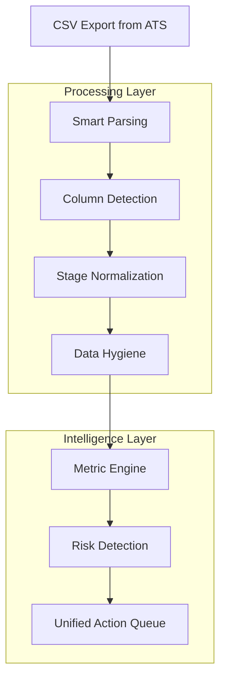
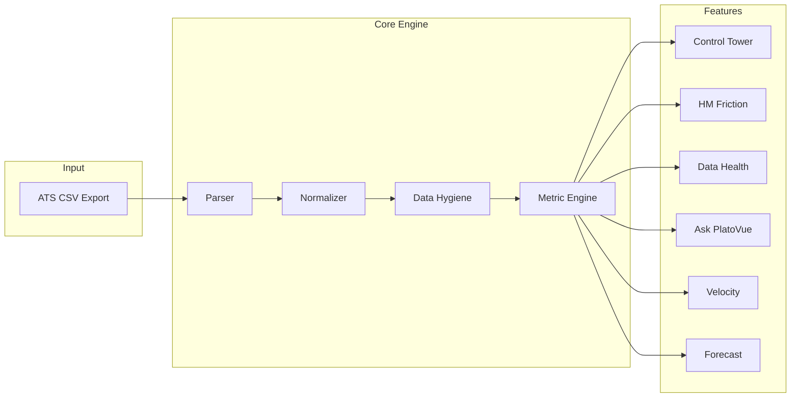
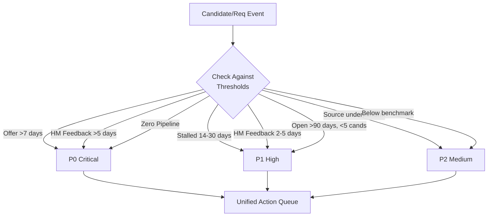

# PlatoVue Presentation Visual Assets
## Diagrams, Charts, and Copy-Paste Elements

---

## Data Pipeline Diagram (Mermaid)

Copy into Mermaid-compatible tools (Notion, GitHub, Excalidraw):



---

## Feature Architecture (Mermaid)



---

## Risk Priority Flow (Mermaid)



---

## ASCII Diagrams (Universal)

### Data Flow

```
┌─────────────────────────────────────────────────────────────────┐
│                         PlatoVue Flow                           │
├─────────────────────────────────────────────────────────────────┤
│                                                                 │
│   ┌──────────┐    ┌──────────┐    ┌──────────┐    ┌──────────┐ │
│   │   ATS    │───▶│  Smart   │───▶│  Clean   │───▶│ Insights │ │
│   │  Export  │    │  Parse   │    │  Data    │    │ & Actions│ │
│   └──────────┘    └──────────┘    └──────────┘    └──────────┘ │
│        │               │               │               │        │
│        ▼               ▼               ▼               ▼        │
│   Raw CSV         Auto-detect     Flag zombies    KPIs, Risks  │
│   (minutes)       columns &       & ghosts        Forecasts    │
│                   stages                          Actions      │
│                                                                 │
└─────────────────────────────────────────────────────────────────┘
```

### Control Tower Layout

```
┌─────────────────────────────────────────────────────────────────┐
│                      CONTROL TOWER                              │
├─────────────────────────────────────────────────────────────────┤
│                                                                 │
│  ┌─────────┐ ┌─────────┐ ┌─────────┐ ┌─────────┐ ┌─────────┐  │
│  │ TTF     │ │ Offers  │ │ Accept  │ │ Stalled │ │ HM      │  │
│  │ 32 days │ │   24    │ │  87%    │ │    3    │ │ 2.1d    │  │
│  │  [🟢]   │ │  [🟢]   │ │  [🟢]   │ │  [🟡]   │ │  [🟢]   │  │
│  └─────────┘ └─────────┘ └─────────┘ └─────────┘ └─────────┘  │
│                                                                 │
├─────────────────────────────────┬───────────────────────────────┤
│         TOP RISKS               │        ACTION QUEUE           │
├─────────────────────────────────┼───────────────────────────────┤
│ 🔴 Offer pending 9d - Jane S.  │ 📋 Follow up: Jane Smith      │
│ 🟠 Zombie: REQ-1234            │ 📋 Close/revive: REQ-1234     │
│ 🟡 Pipeline gap: REQ-5678      │ 📋 Source: REQ-5678           │
│ 🟡 Stalled: REQ-9012           │ 📋 HM nudge: Mike J (3 cands) │
└─────────────────────────────────┴───────────────────────────────┘
```

### HM Latency Comparison

```
                    HM Feedback Latency (days)

Team Average: 2.1 days
─────────────────────────────────────────────────────────────

Sarah Chen    ██ 1.8d
Mike Johnson  ██████████████████████████████████ 8.2d  ⚠️
Lisa Park     ███ 2.0d
Tom Wilson    ████ 2.4d
Amy Davis     ██ 1.5d

─────────────────────────────────────────────────────────────
              0    2    4    6    8    10   12

⚠️ Mike Johnson: 4x team average, 12 candidates waiting
```

### Funnel Visualization

```
                    Recruiting Funnel

Applied         ████████████████████████████████████  1,200
                              │ 45%
Screen          ████████████████████  540
                              │ 62%
HM Review       █████████████  335
                              │ 38%  ◀── BOTTLENECK
Onsite          █████  127
                              │ 71%
Offer           ████  90
                              │ 85%
Hired           ███  77
```

### True TTF vs Raw TTF

```
┌────────────────────────────────────────────────────────────┐
│                  Time to Fill Comparison                    │
├────────────────────────────────────────────────────────────┤
│                                                            │
│  Raw TTF (all reqs)                                        │
│  ████████████████████████████████████████████████  65 days │
│                                                            │
│  True TTF (excluding zombies)                              │
│  ██████████████████████████████  41 days                   │
│                                                            │
│  ─────────────────────────────────────────────────────     │
│  │         DIFFERENCE: 24 DAYS (37% inflation)       │     │
│  ─────────────────────────────────────────────────────     │
│                                                            │
│  Why: 47 zombie reqs averaging 180 days open               │
│                                                            │
└────────────────────────────────────────────────────────────┘
```

---

## Key Statistics Callouts

### For Slides

**STAT 1:**
```
┌─────────────────────────────────────────┐
│                                         │
│         4-8 HOURS / WEEK                │
│                                         │
│   Time TA leaders spend building        │
│   reports manually from ATS exports     │
│                                         │
└─────────────────────────────────────────┘
```

**STAT 2:**
```
┌─────────────────────────────────────────┐
│                                         │
│              80%                        │
│                                         │
│   of preventable candidate drop-off     │
│   happens waiting for HM feedback       │
│                                         │
└─────────────────────────────────────────┘
```

**STAT 3:**
```
┌─────────────────────────────────────────┐
│                                         │
│           15-40%                        │
│                                         │
│   TTF inflation caused by              │
│   zombie reqs in typical ATS           │
│                                         │
└─────────────────────────────────────────┘
```

**STAT 4:**
```
┌─────────────────────────────────────────┐
│                                         │
│           5 MINUTES                     │
│                                         │
│   From CSV upload to full              │
│   dashboard with insights              │
│                                         │
└─────────────────────────────────────────┘
```

---

## Comparison Tables

### Before/After

| Before PlatoVue | After PlatoVue |
|-----------------|----------------|
| 4-8 hrs/week building reports | 5 min CSV import |
| Stale weekly snapshots | Real-time risk alerts |
| No HM accountability | Full latency visibility |
| Inflated TTF metrics | True TTF (clean data) |
| Reactive firefighting | Proactive action queue |
| "Why did that take so long?" | Instant stage breakdown |

### Feature Comparison

| Capability | Spreadsheets | Basic ATS Reports | PlatoVue |
|------------|--------------|-------------------|----------|
| TTF calculation | Manual | Basic | True TTF (excludes zombies) |
| HM latency tracking | None | None | Full scorecard |
| Zombie detection | None | None | Automatic |
| Risk prioritization | None | None | P0/P1/P2 queue |
| Natural language queries | None | None | Ask PlatoVue |
| Forecasting | Manual | None | Probability-weighted |

---

## Icon Suggestions

For presentation software, use these icons:

| Feature | Suggested Icon | Bootstrap Icon |
|---------|----------------|----------------|
| Control Tower | Speedometer | `bi-speedometer2` |
| HM Friction | People | `bi-people` |
| Data Health | Database check | `bi-database-check` |
| AI Copilot | Robot | `bi-robot` |
| Ask PlatoVue | Chat dots | `bi-chat-dots` |
| Forecasting | Graph up | `bi-graph-up-arrow` |
| Risk (P0) | Exclamation circle | `bi-exclamation-circle-fill` |
| Risk (P1) | Exclamation triangle | `bi-exclamation-triangle-fill` |
| Action | Check square | `bi-check-square` |
| Zombie | Ghost emoji | N/A |

---

## Color Palette

Use these colors for consistency with the product:

| Element | Hex | Usage |
|---------|-----|-------|
| Background | `#0f172a` | Deep navy (slides) |
| Surface | `#1e293b` | Card backgrounds |
| Primary Accent | `#f59e0b` | CTAs, highlights |
| Cyan | `#06b6d4` | Secondary accent |
| Violet | `#8b5cf6` | Tertiary accent |
| Success | `#22c55e` | Green indicators |
| Warning | `#eab308` | Yellow indicators |
| Danger | `#ef4444` | Red indicators |
| Text Primary | `#f8fafc` | Main text |
| Text Secondary | `#94a3b8` | Muted text |

---

## Slide Background Gradients

CSS gradients that can be recreated in design tools:

**Hero gradient:**
```css
background:
  radial-gradient(ellipse 80% 50% at 50% -20%, rgba(245, 158, 11, 0.15) 0%, transparent 50%),
  radial-gradient(ellipse 60% 40% at 80% 60%, rgba(6, 182, 212, 0.1) 0%, transparent 50%),
  #0f172a;
```

**CTA section gradient:**
```css
background:
  radial-gradient(ellipse 60% 40% at 50% 100%, rgba(139, 92, 246, 0.1) 0%, transparent 50%),
  #0f172a;
```

---

## Quote Blocks

```
┌──────────────────────────────────────────────────────────────┐
│                                                              │
│  "Your TTF looks like 65 days, but 30% of your reqs are     │
│   zombies. True TTF is actually 41 days."                   │
│                                                              │
│                              — PlatoVue Data Health Engine   │
│                                                              │
└──────────────────────────────────────────────────────────────┘
```

```
┌──────────────────────────────────────────────────────────────┐
│                                                              │
│  "80% of preventable candidate drop-off happens while       │
│   waiting for hiring manager feedback."                     │
│                                                              │
│                              — Industry Research             │
│                                                              │
└──────────────────────────────────────────────────────────────┘
```

```
┌──────────────────────────────────────────────────────────────┐
│                                                              │
│  "As a TA Leader, I need to know in 30 seconds if we're     │
│   on track or if something needs my attention."             │
│                                                              │
│                              — User Research                 │
│                                                              │
└──────────────────────────────────────────────────────────────┘
```
